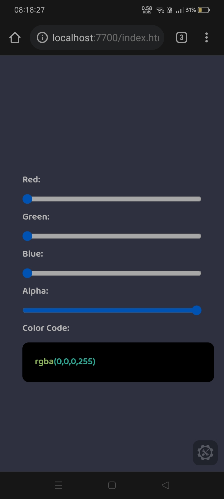

## Custom Color Picker
This project allow you to pick different color using 4 bars which stands for red, blue, green and alpha.

## How to Use?
Drag the bars according to you and you would find color code on bottom and tap on it to copy it on clipboard.

## Demo of Website

## About Me
I am Devesh Sharma from India. I am 13 years old student currently studying in JNV Panipat Class 9th B. I know several programming languages such as C, C++, Java, Python, HTMl, CSS and JavaScript. I have also worked with reactJs as framework. I am passionate about programming.
